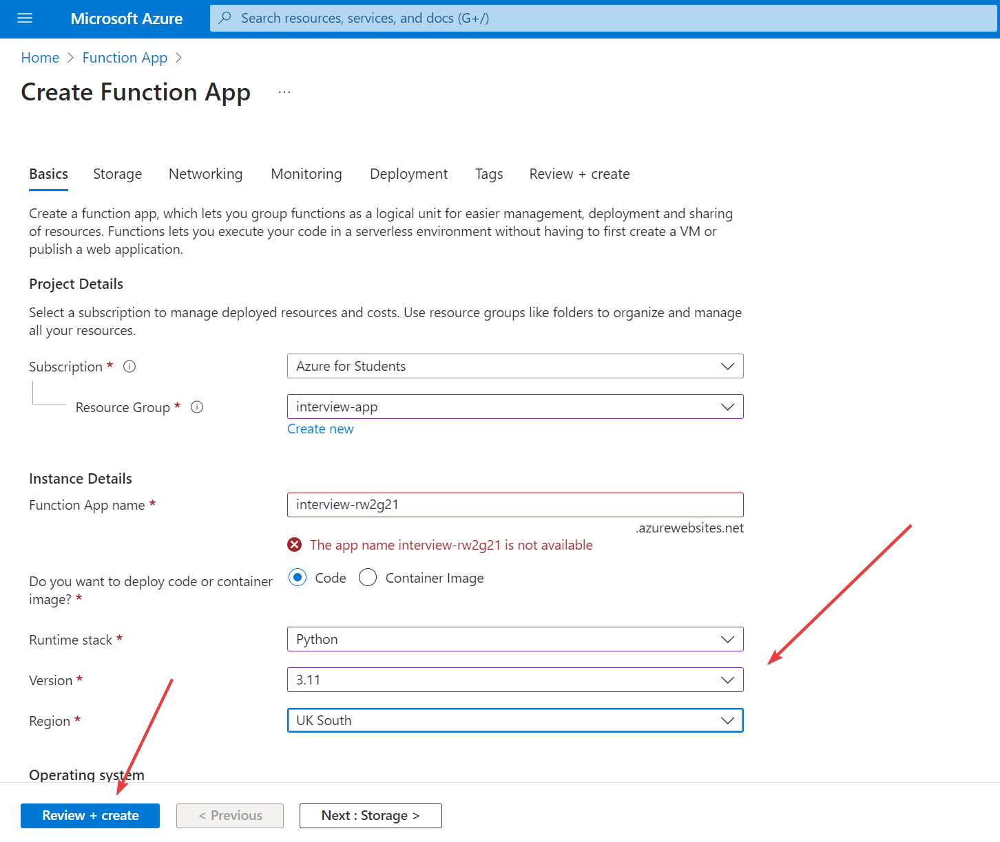
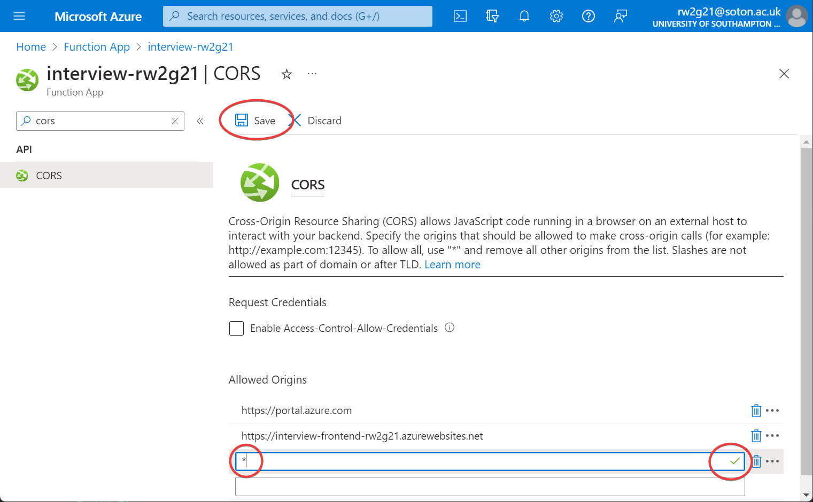
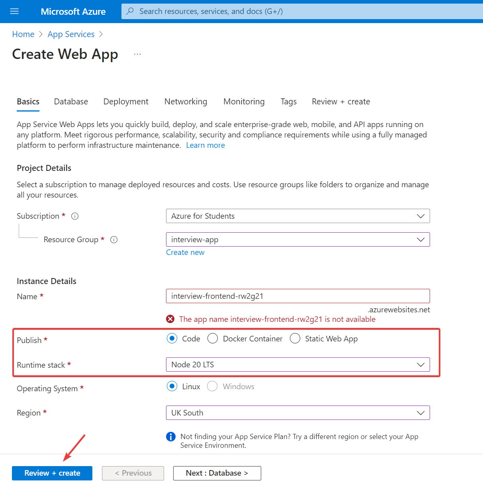
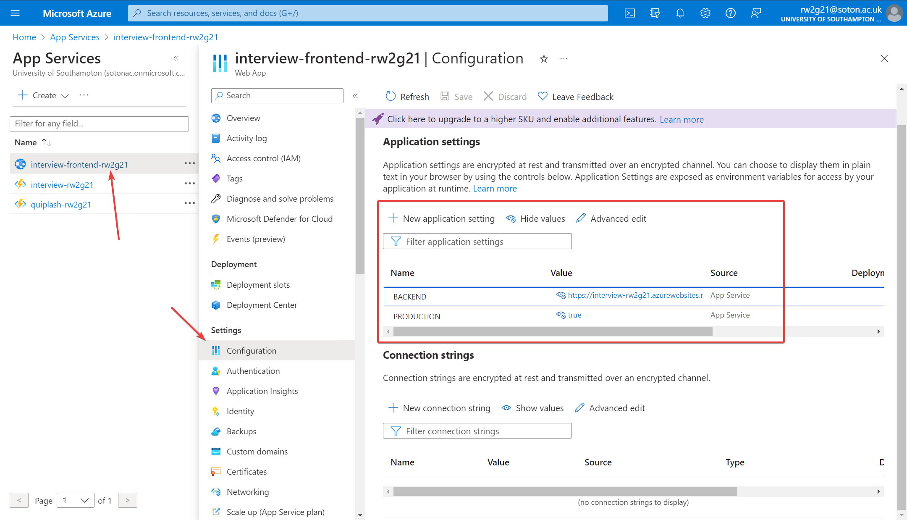

# COMP3207-cloud-app-dev

## Deployment
These instructions assume you are using a Unix based system. If you are on Windows, you can use WSL to gain access to a Unix shell.

### Local Development
To run the application locally, `cd GroupCW` to begin with - this is the root directory for the source files.

Backend:
```bash
cd AzureFunctions
python3 -m venv .
source bin/activate
pip3 install -r requirements.txt
func start
```

Frontend:
```
# From GroupCW
npm start
```

The frontend will be accessible at http://localhost:8080

### Cloud Deployment
As our GCP credits have expired, we chose to deploy both the frontend and the backend to Microsoft Azure.

I have written a Bash script that is capable of deploying the frontend and the backend automatically: [scripts/deploy.sh](GroupCW/scripts/deploy.sh). Simply run with `./GroupCW/scripts/deploy.sh` and answer the prompts. The script is dependent on `jq` being installed, and `az` being installed and the Azure account being logged in (`az login`).

Before you run the script, you must have **already** created:
- An Azure resource group ([link](https://portal.azure.com/#view/HubsExtension/BrowseResourceGroups))
- An Azure function app ([link](https://portal.azure.com/#create/Microsoft.FunctionApp)), within the resource group - the backend will be deployed here. Select **Python 3.11**.
- An Azure *App Services Web App* ([link](https://portal.azure.com/#create/Microsoft.WebSite)), within the resource group - the frontend will be deployed here. Select **Node 20 LTS**.

Screenshots of this process can be found below in the [Manual Deployment](#manual-deployment) section.

Note down the names of the resource group and apps, as these will be needed when you run the script.

For the purposes of marking this coursework, we have provided access to our Azure services (such as CosmosDB) so that data is readily available.

The script will prompt you and ask "Override Azure subscription ID?" - if you encounter Forbidden errors, you may need to do this. This is due to Azure trying to run the app under the university's subscription / cost centre, rather than your own. You can find your own subscription ID [here](https://portal.azure.com/#view/Microsoft_Azure_Billing/SubscriptionsBladeV2). Note "End User Computing Infrastructure" is the university's subscription and *not* the one you should use.

### Manual Deployment
If you wish to deploy the app manually, rather than using the script, you may do so.

#### Manual Backend Deployment
First, create an Azure [resource group](https://portal.azure.com/#view/HubsExtension/BrowseResourceGroups) and [function app](https://portal.azure.com/#create/Microsoft.FunctionApp) running Python 3.11.



Then, `cd` into `GroupCW/AzureFunctions` and run the following command, replacing `FUNCTION_APP_NAME` accordingly:

```bash
func azure functionapp publish FUNCTION_APP_NAME
```

Finally, you will have to configure the CORS settings on the Azure portal. Go to the function app, select CORS from the sidebar and then add `*` as an allowed origin (or the frontend app URL). It is safe to use `*` as the site does not use cookies for authentication (rather, an Authorization header with fetch HTTP requests), so CSRF is not possible.



#### Manual Frontend Deployment
First, create an Azure `App Services Web App` (search App Services -> Click Create -> Select "Web App"). Select `Publish: Code` and `Node 20 LTS` for the stack, and then press `Review + create`:



Once created, select the web app on the Azure portal, select "Configuration" from the sidebar and make sure the "Application settings" tab is open. Click "New application setting" and create 2 new values:

1. Set `BACKEND` to the URL of the backend function app, without a trailing slash, e.g. `https://interview-rw2g21.azurewebsites.net`
2. Set `PRODUCTION` to `true` (lowercase)



Now, we can begin to deploy the code. `cd` into `GroupCW` and then create a zip file containing the files & directories `node_modules`, `public/`, `views/`, `package.json`, `package-lock.json` and `app.js`. The following command can be used to do this to produce a `src.zip` file:

```bash
zip -r src.zip node_modules public/ views/ package.json package-lock.json app.js
```

Then, run the following command to upload the zip file to Azure, replacing `RESOURCE_GROUP_NAME`, `WEB_APP_NAME` and `src.zip` accordingly:
```bash
az webapp deploy --resource-group RESOURCE_GROUP_NAME --name WEB_APP_NAME --src-path src.zip --type zip
```

Alternatively, if you have problems with this method, you can upload the code directly on the Azure portal under "Deployment Center" on the web app, however, this is not recommended.

Once you have completed this, the site will be live!

## Project Info

Doc: https://docs.google.com/document/d/1yVnwa8kj9aXzCfbb7thvh3iec4dCnRDZ05kLQzOwXIE/edit


BackEnd put everything in AzureFunctions (everything will be tested locally)
FronEnd: public/game.js, views/client.ejs, app.js
Css: public/main.css

!WARNING!
Do not change the documents name, this is how it is supposed to be called for submission:
Example Documentation can be found in the doc.

Group Courework Documentation Link: https://www.overleaf.com/9943653534vjkzsrdmnctx#512417


Current Teams:
Backend:
Sam
Alyssa
Apishan
Lele

FrontEnd:
Josh
Ryan
Will

Css
- Josh

Writing Documentation:
Alyssa
Lele

Proof Reader:
- Josh